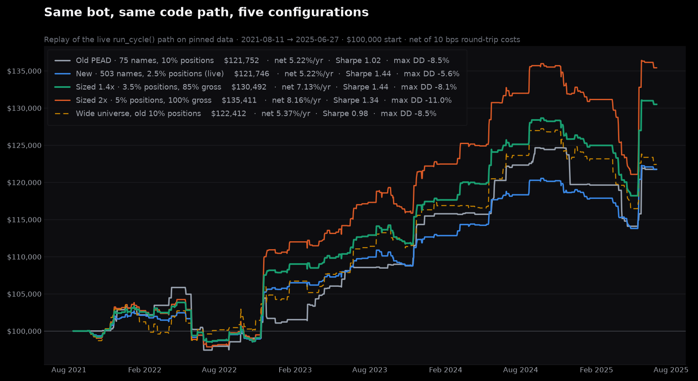

# Configuration comparison — traded universe and position sizing

Every row is the REAL `bot/run_cycle.py` path replayed day by day over the cached model's
holdout window (2021-08-11 → 2025-06-27, 974 trading days) via
`live_backtest/run_historical_replay.py`. Only the traded universe and the two risk caps differ.

| Configuration | Names | Trades | Gross return | Fees charged | **Net return** | Volatility | Sharpe | Max drawdown | Win rate |
|---|---:|---:|---:|---:|---:|---:|---:|---:|---:|
| Sized 2x · 5% positions, 100% gross | 503 | 625 | 8.74% | 0.58% | **8.16%** | 5.99% | 1.34 | -11.0% | 55.0% |
| Sized 1.4x · 3.5% positions, 85% gross | 503 | 655 | 7.61% | 0.48% | **7.13%** | 4.87% | 1.44 | -8.1% | 55.3% |
| Wide universe, old 10% positions | 503 | 368 | 5.85% | 0.48% | **5.37%** | 5.50% | 0.98 | -8.5% | 53.5% |
| Old PEAD · 75 names, 10% positions | 75 | 189 | 5.49% | 0.26% | **5.22%** | 5.13% | 1.02 | -8.5% | 57.1% |
| New · 503 names, 2.5% positions (live) | 503 | 614 | 5.58% | 0.36% | **5.22%** | 3.57% | 1.44 | -5.6% | 55.0% |

## Reading this honestly

- **The window is not pristine.** 2021-08 → 2025-06 is the holdout the model was validated on and
  that this project has now examined repeatedly. It is out-of-sample for the model's fit, not for
  the accumulated choices made while studying it.
- **Costs are charged flat.** The execution client charges 10 bps round trip on every close, the same
  assumption the cost-adjusted training label uses, so these curves are net of fees. Slippage,
  borrow on shorts and market impact are still unmodeled.
- **Sizing changes risk, not edge.** The sized-up rows earn more because they bet more, not
  because the signal improved; their drawdowns grow roughly in step.
- **The wider universe is what improved quality.** Same return as the old configuration at a third
  less volatility, because one 10% position is replaced by several 2.5% ones.
- **Gross exposure never exceeds 100%**, so no configuration here borrows; margin cost is not modeled.

Reproduce: `PYTHONPATH=. .venv/bin/python -m live_backtest.compare_configurations`
