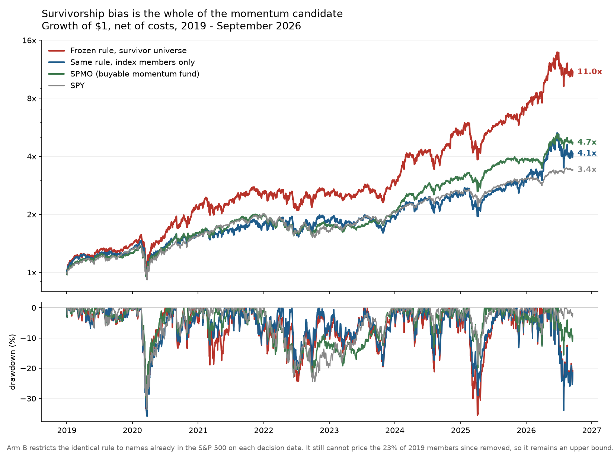

# Verification of the stock-momentum candidate, 19 September 2026

**The candidate's advantage is survivorship bias.** Running the identical, untouched rule on a
universe restricted to stocks that were already in the S&P 500 on each decision date takes it from
36.55% CAGR / 1.00 Sharpe to **20.32% CAGR / 0.66 Sharpe** over 2019–September 2026, and from
22.66% / 0.80 to **14.27% / 0.58** over 2008–2026. Its Fama-French five-factor plus momentum alpha
falls from **13.97%/yr (t = 2.61) to 0.57%/yr (t = 0.13)**.

The de-biased version is beaten on both return and Sharpe by SPMO, a momentum ETF anyone can buy:
22.38% / 0.89 over the same 2019–2026 window.

The correction is an upper bound, not a floor. The price cache cannot price 23% of the S&P 500
members of 2019 and 50% of the members of 2008, because those companies have since left the index.
The true point-in-time result is below 20.32%.

## Why the bias is this large

The price cache is exactly today's 503 S&P 500 members. A company enters that list by growing into
it. The rule buys the top 20 stocks by trailing twelve-month return, skipping the last month — that
is, it selects on precisely the dimension along which the universe was pre-selected. In 2019 the
rule could choose from 115 companies that were not yet in the index and would only be admitted
later, on the strength of the returns the rule is ranking them by — among them AppLovin, Axon,
Palantir, Builders FirstSource and Vistra. In 2008 that count is 212.

The effect is visible even without any strategy. An equal-weighted portfolio of the cached universe
returned 19.31%/yr over 2019–2026 against 13.56% for RSP, the real equal-weight S&P 500 fund. An
equal-weight book beating the cap-weighted SPY (17.30%) through the mega-cap era is not something
equal weighting does; real equal weight lost to SPY by 3.7 points a year over that stretch.

## Results

All figures net of the frozen 5bps-per-side costs, marked daily, excess over the 13-week bill.

### Continuous record, 2019 – 17 September 2026

| Series | Net CAGR | Excess Sharpe | Vol | Max DD |
|---|---:|---:|---:|---:|
| A — frozen rule, survivor universe | 36.55% | 1.00 | 34.2% | −35.50% |
| **B — same rule, index members only** | **20.32%** | **0.66** | 31.0% | −35.89% |
| Survivor-universe equal weight | 19.31% | 0.82 | 20.8% | −37.69% |
| SPMO, buyable momentum fund | 22.38% | 0.89 | 22.3% | −30.95% |
| MTUM, buyable momentum fund | 16.94% | 0.67 | 23.3% | −34.08% |
| RSP, real equal-weight S&P 500 | 13.56% | 0.60 | 19.8% | −39.04% |
| SPY | 17.30% | 0.78 | 19.3% | −33.72% |

### Every window

| Series | 2019–2025-06 | 2025-07–2026-09 | 2019–2026 | 2008–2026 |
|---|---:|---:|---:|---:|
| A — survivor universe | 31.05% / 0.94 | 70.05% / 1.28 | 36.55% / 1.00 | 22.66% / 0.80 |
| B — members only | 16.33% / 0.59 | 44.02% / 0.96 | 20.32% / 0.66 | 14.27% / 0.58 |
| SPMO | 21.85% / 0.89 | 25.21% / 0.93 | 22.38% / 0.89 | 18.87% / 0.84 |
| SPY | 16.80% / 0.74 | 20.01% / 1.24 | 17.30% / 0.78 | 11.25% / 0.57 |

The evaluation window is the one place the candidate holds up, and that is expected: by 2025–2026 the
cache prices 95–98% of actual members, so there is little bias left to remove. Arm B still returned
44.02% there. But it is 306 trading days at 44.6% volatility with a 33.9% drawdown, its Sharpe of
0.96 is below SPY's 1.24 in the same window, and the frozen rule was chosen after that history was
already visible to the wider project.

### Factor attribution, FF5 + UMD, Newey-West(10), 2019–2026

| Series | Annual alpha | t | Market β | UMD β |
|---|---:|---:|---:|---:|
| A — survivor universe | 13.97% | 2.61 | 1.27 | 0.74 |
| **B — members only** | **0.57%** | **0.13** | 1.20 | 0.67 |
| Survivor-universe equal weight | 2.16% | 1.88 | 1.01 | −0.05 |
| SPMO | 3.37% | 1.28 | 1.03 | 0.28 |
| MTUM | −1.19% | −0.49 | 1.05 | 0.37 |
| RSP | −1.71% | −1.19 | 0.94 | −0.11 |
| SPY | −0.12% | −0.33 | 0.98 | −0.01 |

Arm B is a momentum-and-market portfolio with no alpha: market beta 1.20, momentum beta 0.67,
intercept indistinguishable from zero. Its 0.57% residual has a standard error of 4.3 points a year.

### Inference on the de-biased arm

| | Sharpe | 95% CI, 20-day circular block bootstrap |
|---|---:|---|
| B, 2019–2026 | 0.66 | [0.08, 1.27] |
| B, 2008–2026 | 0.58 | [0.19, 0.99] |

Both intervals contain the project's 0.70 PEAD benchmark and both contain SPY's passive Sharpe, so
this does not establish an improvement on either. Deflated Sharpe probability against the project
trial ledger is 0.43 at 85 trials and 0.40 at 109 — below one half, meaning the result does not
survive correction for how many strategies this project has now tried.

## Method

**Membership reconstruction.** Today's 503 constituents, walked backwards through the 407-row dated
changes ledger: at each effective date, the added ticker is removed and the removed ticker restored.
The reconstruction holds between 502 and 515 names across the whole span with no drift, and records
12–26 changes a year from 2011 onward, consistent with the index's actual turnover. It thins before
2011 (2 changes recorded in 2005, 1 in 2006), so arm B's 2008–2010 universe is still closer to
today's membership than the truth, biasing that window upward as well. This is a documented
reconstruction from a public ledger, not a certified point-in-time constituent feed.

**Coverage.** Members priced by the cache, by year: 2008 50%, 2013 62%, 2019 77%, 2022 85%, 2025
94%, 2026 98%. Uncovered members are recorded, never forward-filled or silently dropped.

**Independent recomputation.** Arm A, rebuilt here from the raw parquet files with an independent
implementation of the rule and the frozen execution engine, returns 36.55% / 1.00 against the
original run's 36.22% / 1.00 (2019–2026) and 22.66% / 0.80 against 22.52% / 0.80 (2008–2026). The
small gap is the original's stricter requirement that every price feature be finite. The frozen
engine reproduces.

**Untouched.** No lookback, threshold, weight, slot count or cost assumption was changed. Arms A and
B differ in one thing: which names are allowed into the ranking.

## What this changes for the project

The cached stock universe inflates any test that selects on past returns by roughly 16 percentage
points of CAGR a year over 2019–2026 and 8 points over 2008–2026, and it manufactures the entire
factor alpha of a momentum book. Three earlier studies that ran on this universe — the fundamentals
test, the survivor composite and the insider study — were affected by the same defect, which was
suspected then and is now measured.

`research/momentum_verification/membership.py` gives any future stock test a point-in-time
membership mask. It does not fix the missing prices for removed companies, which still requires a
survivorship-free database.

## Artifacts

- [Registered plan](../../research/momentum_verification/PLAN.md) — registered 2026-09-19T22:32:50, before any result
- [Window table](final_table.json), [attribution](final_attribution.json), [inference](inference.json)
- [Membership coverage by month](membership_coverage.csv), [arm results](membership_arms.json)
- Daily NAV: `A_cache_universe_*.csv`, `B_point_in_time_members_*.csv`
- [Source manifest with sha256 for every download](inputs/source_manifest.json)
